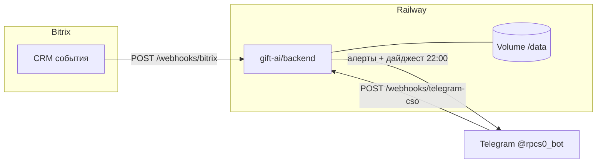

# Деплой на Railway

Нужно **два сервиса** из одного репозитория: API и Telegram-бот.

> ⚠️ Одновременно должен работать **только один** экземпляр бота (локально или на Railway). Иначе Telegram молчит.

---

## Сервис 1 — API (backend)

1. [railway.app](https://railway.app) → **New Project** → **Deploy from GitHub** → репозиторий `pressa`
2. **Settings → Root Directory:** `gift-ai/backend`
3. **Variables:**

| Переменная | Значение |
|------------|----------|
| `GEMINI_API_KEY` | ваш ключ Gemini |
| `ADMIN_API_KEY` | пароль для админки |
| `DATABASE_PATH` | `/data/gift-ai.db` |
| `BITRIX24_WEBHOOK_URL` | (когда будет) URL вебхука Bitrix |
| `BITRIX24_TAG` | `Подбор подарка AI` |
| `ROP_ALERTS_ENABLED` | `true` |
| `ROP_ALERTS_TELEGRAM_BOT_TOKEN` | тот же `BOT_TOKEN` что у бота |
| `ROP_ALERTS_TELEGRAM_CHAT_IDS` | Telegram user id РОПа (число) |
| `BITRIX24_OUTBOUND_TOKEN` | токен исходящего webhook Bitrix |
| `BITRIX24_PORTAL_URL` | `https://ваш-портал.bitrix24.eu` |
| `PUBLIC_API_URL` | публичный URL этого сервиса (без слэша) |

`PORT` Railway подставит сам — не трогайте.

4. **Volume** (чтобы диалоги не пропадали при перезапуске):
   - Settings → **Volumes** → Add Volume
   - Mount path: `/data`

5. Deploy. В логах: `Gift AI API started`
6. **Settings → Networking → Generate Domain** — скопируйте URL, например:
   `https://gift-ai-api-production.up.railway.app`

Проверка: откройте `https://ваш-url/health` — должно быть `{"ok":true,...}`

---

## Сервис 2 — Telegram-бот

1. В том же проекте Railway: **+ New Service** → **GitHub Repo** → тот же репозиторий
2. **Root Directory:** `gift-ai/telegram-bot`
3. **Variables:**

| Переменная | Значение |
|------------|----------|
| `BOT_TOKEN` | токен от @BotFather |
| `API_URL` | URL API из шага 1 (без слэша в конце) |
| `ADMIN_API_KEY` | тот же ключ, что у API — для `/admin` в боте |
| `ADMIN_TELEGRAM_IDS` | ваш Telegram user id (через запятую) — доступ к `/admin` |

Голосовые распознаются через API — `GEMINI_API_KEY` нужен только на **сервисе API** (шаг 1). На боте ключ не обязателен.

Пример: `API_URL=https://gift-ai-api-production.up.railway.app`

4. Deploy. В логах: `✅ @rpgifts_bot — gift consultant bot`

---

## CSO-бот и алерты РОПа (@rpcs0_bot)

**Важно:** команды `/start`, `/settings` и алерты обрабатывает **сам backend** — отдельный сервис `telegram-bot` для этого не нужен. Достаточно задеплоить **только API**.

### Схема

### Переменные (добавить к таблице выше)

| Переменная | Значение |
|------------|----------|
| `ROP_ALERTS_ENABLED` | `true` |
| `ROP_ALERTS_TELEGRAM_BOT_TOKEN` | токен @rpcs0_bot |
| `BITRIX24_WEBHOOK_URL` | входящий webhook Bitrix (для запросов в CRM) |
| `BITRIX24_OUTBOUND_TOKEN` | токен исходящего webhook |
| `BITRIX24_PORTAL_URL` | `https://bb-wood.bitrix24.eu` |
| `PUBLIC_API_URL` | **ваш Railway URL** (см. шаг ниже) |
| `ROP_ALERT_DAILY_DIGEST_ENABLED` | `true` (итоги дня в 22:00 МСК) |

`ROP_ALERTS_TELEGRAM_CHAT_IDS` — опционально, если подписчики только через `/start` в боте.

### Порядок действий

1. **Deploy API** → Settings → Networking → **Generate Domain**  
   Пример: `https://gift-ai-api-production.up.railway.app`

2. **Variables** → `PUBLIC_API_URL` = этот URL **без слэша в конце** → **Redeploy**

3. После старта API сам выставит webhook Telegram на  
   `https://ваш-url/webhooks/telegram-cso` (см. логи: `CSO bot webhook set`).

4. **Bitrix24** → Разработчикам → Исходящий webhook:
   - URL: `https://ваш-url/webhooks/bitrix`
   - События: `ONCRMLEADADD`, `ONCRMLEADUPDATE`, `ONCRMDYNAMICITEMADD`, `ONCRMDYNAMICITEMUPDATE`, `ONIMCONNECTORMESSAGEADD`, `ONCRMDEALUPDATE`
   - Токен → `BITRIX24_OUTBOUND_TOKEN` в Railway → Redeploy

5. **Остановите локальный API** на Mac (`launchctl unload` или закройте `npm run dev`). Иначе два процесса и нестабильный webhook.

6. В Telegram: `/start` → `/settings` у @rpcs0_bot.

### Проверка

| Что | Как |
|-----|-----|
| API жив | `curl https://ваш-url/health` → `{"ok":true}` |
| Webhook Telegram | `curl "https://api.telegram.org/bot<TOKEN>/getWebhookInfo"` → `url` = ваш Railway |
| Дайджест (превью) | `POST /admin/rop-alerts/daily-digest` с заголовком `x-admin-key` |
| Команды бота | `/settings` в чате — ответ в течение секунды |

Локально (Mac, без Railway): `./gift-ai/backend/scripts/install-rop-alerts.sh` — tunnel + webhook (нестабильно, только для отладки).

---

## После деплоя

1. **Остановите** локальные `npm run dev` и `npm run dev:bot` на Mac
2. Напишите боту в Telegram `/start`

---

## Частые проблемы

| Симптом | Решение |
|---------|---------|
| Бот молчит | Локальный бот ещё запущен — остановите |
| «Не удалось обработать» | Проверьте `API_URL` у бота и `/health` у API |
| Данные пропали | Подключите Volume на `/data` |
| 409 Conflict | Два процесса с одним `BOT_TOKEN` |

---

## Админка

Откройте `gift-ai/admin/index.html` локально.  
API URL — публичный Railway URL, ключ — `ADMIN_API_KEY`.
